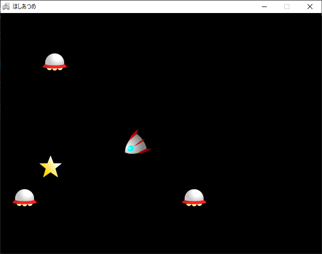

# 🌟 ほしあつめ 🌟

Ruby + DXRuby で作られたサンプルゲームです。

## 起動方法 🚀

### 実行ファイル版

リリースページから「ほしあつめ.zip」をダウンロード＆展開し、「ほしあつめ.exe」を実行してください。

### ソースコード版

[Ruby Installer](https://rubyinstaller.org/) と [DXRuby](https://dxruby.osdn.jp/) のインストールされた環境で、

```
ruby ほしあつめ.rb
```

としてください。

## 操作方法 🛸



🚀 を操作して、🛸 を避けながら ⭐ をあつめましょう。⭐ を取るたびに 🛸 は増えていきます。10点を超えると隠しメッセージがあるよ！

🚀 は ← → キーで回転、↑ で加速、↓ で減速します。
